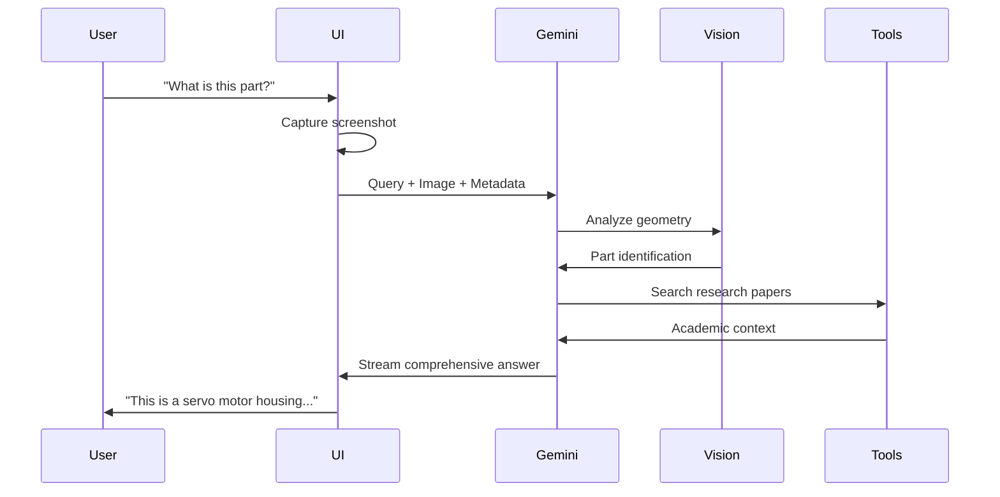
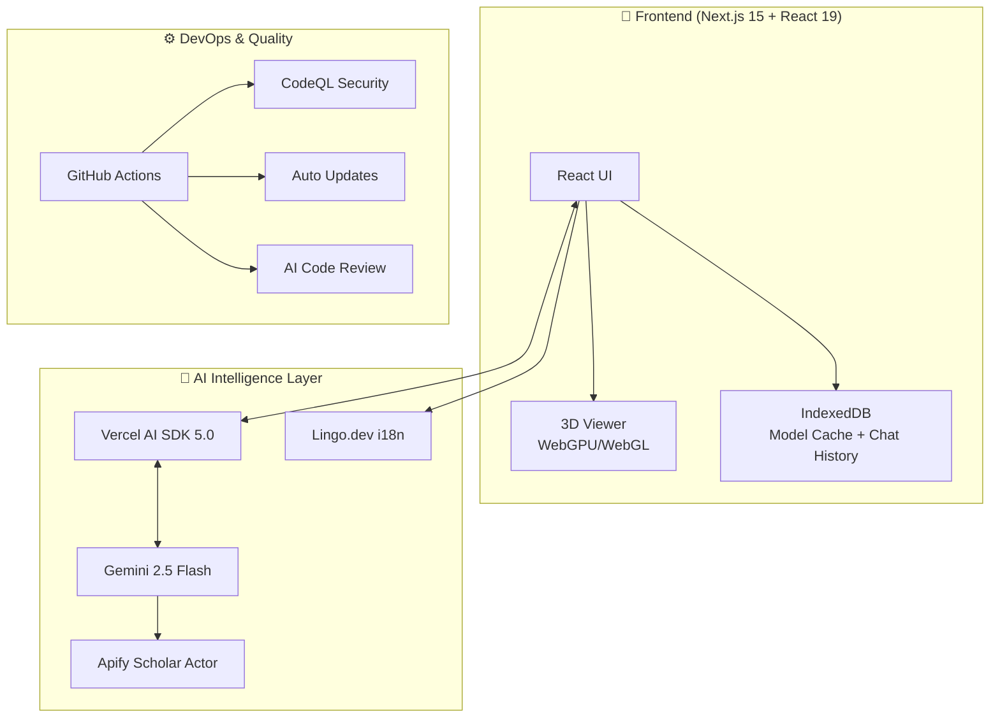
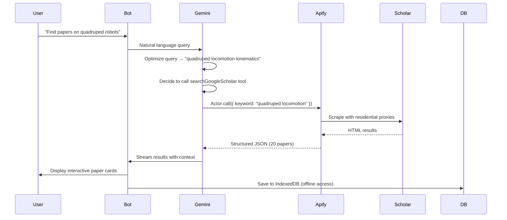

# Three21: AI-Powered X-Ray Vision for 3D Engineering
## MLH Hackathon Presentation 🚀

---

## 🦈 Slide 1: The Hook (Shark Tank Pitch)

**"Sharks, imagine you're an engineer trying to understand a complex jet engine or a robotic arm."**

### The Problem 😰
- Engineers are **stuck** staring at 2D blueprints or static 3D models
- You **can't see inside**
- You **can't understand** how it fits together without manual explosion (takes hours)
- It's like **trying to learn surgery from a photograph**

### The Solution ✨
**Enter Three21** - The "X-Ray Vision" for Engineering

We use **AI** and **advanced spatial algorithms** to:
- ✅ **Automatically disassemble** any 3D model, layer by layer
- ✅ **Preserve hierarchy** (screws move with covers, covers with blocks)
- ✅ **Understand context** with multimodal AI vision
- ✅ **Answer questions** like talking to a senior engineer

### The Impact 🎯
We're **revolutionizing** how engineers:
- 🎓 **Learn** complex systems
- 🔍 **Analyze** design intent
- 🔧 **Reverse-engineer** products
- 📚 **Research** academic papers in real-time

---

## 🧠 Slide 2: Powered by Gemini 2.5 Flash

**"We don't just render pixels; we understand them."**

### Multimodal AI Integration

| Capability | Technology | Result |
|-----------|-----------|---------|
| **Vision** | Gemini 2.5 Flash | Understands 3D geometry from screenshots |
| **Context** | Metadata Analysis | Knows material names, hierarchy, dimensions |
| **Streaming** | Vercel AI SDK 5.0 | Real-time conversational responses |
| **Research** | Apify + Tool Calling | Fetches academic papers on demand |

### How It Works



### Live Example

**Input**: Screenshot of quadruped robot + "Analyze the locomotion system"

**Output**:
```
🤖 Analyzing...

I can see a quadruped robotic platform with:
• 12 servo motors (3 per leg: hip, knee, ankle)
• Aluminum chassis with reinforced joints
• Center-mounted battery pack for balance
• Estimated weight distribution: 40% chassis, 60% motors

Manufacturing Analysis:
• CNC machined components (visible tool marks)
• Anodized aluminum (corrosion resistance)
• M3 socket head screws (standard metric)

📚 Would you like me to find research papers on quadruped robot kinematics?
```

---

## 🏗️ Slide 3: System Architecture - The Complete Picture

### Layer 1: High-Level Architecture



---

## 🎨 Slide 4: The Rendering Engine - BFS Magic

**"Disassembly that Makes Engineering Sense"**

### The Challenge
- Disassembling isn't just **moving parts away**
- Must **respect hierarchy**: screw → cover → engine block
- Must be **visually intuitive** for engineers

### Our Algorithm

```javascript
// BFS-Based Hierarchical Explosion
function explodeModel(sceneGraph, explosionFactor) {
    // 1. BFS Traversal to map hierarchy
    const hierarchy = new Map();
    const queue = [sceneGraph.root];
    
    while (queue.length > 0) {
        const node = queue.shift();
        hierarchy.set(node.id, {
            parent: node.parent,
            children: node.children,
            center: node.boundingBox.center
        });
        queue.push(...node.children);
    }
    
    // 2. Calculate radial vectors from parent centers
    for (const [id, data] of hierarchy) {
        if (data.parent) {
            const parentCenter = hierarchy.get(data.parent.id).center;
            data.vector = data.center.clone().sub(parentCenter).normalize();
        }
    }
    
    // 3. Apply explosion with hierarchy preservation
    for (const [id, data] of hierarchy) {
        const depth = getDepth(id, hierarchy);
        const offset = data.vector?.multiplyScalar(explosionFactor * depth) || 0;
        animatePosition(id, offset);
    }
}
```

### Visual Flow

```
Solid Model → BFS Scan → Hierarchy Map → Vector Calc → Smooth Animation
   (GLB)     (O(n))     (Parent/Child)   (Radial)      (60 FPS)
```

---

## 📚 Slide 5: Apify Google Scholar Integration

**"Real-Time Research at Your Fingertips"**

### The Innovation
Traditional CAD tools are **disconnected from research**. Engineers have to:
1. Leave the app
2. Google search
3. Find papers
4. Come back
5. Context switch = productivity killer 💀

### Our Solution: AI Tool Calling



### Technical Implementation (AI SDK 5.0)

**Server-Side Tool Definition:**
```javascript
// app/api/chat/route.js
import { streamText, tool } from 'ai';
import { z } from 'zod';

tools: {
    searchGoogleScholar: tool({
        description: 'Search academic papers on Google Scholar',
        parameters: z.object({
            query: z.string().describe('Scholarly keywords'),
            maxItems: z.number().optional(),
            minYear: z.number().optional()
        }),
        execute: async ({ query, maxItems, minYear }) => {
            // Call Apify Actor
            const results = await apifyClient
                .actor("kdjLO0hegCjr5Ejqp")
                .call({ keyword: query, maxItems: maxItems || 20 });
            
            return {
                count: results.length,
                results // Full metadata array
            };
        }
    })
}
```

**Apify Actor Benefits:**
- ✅ **Bypasses rate limiting** (residential proxy network)
- ✅ **Structured data** (clean JSON, not HTML soup)
- ✅ **Reliable scraping** (handles Google's anti-bot measures)
- ✅ **Complete metadata** (citations, authors, links, year)

### Live Demo Output

**Input**: "Find research on soft robotics actuation"

**Output**:
```
🔍 Searching Google Scholar...
✓ Complete

📚 Found 20 papers

[1] Pneumatic Networks for Soft Robotic Actuation
    Authors: F Ilievski, AD Mazzeo, RF Shepherd...
    Science, 2011
    📅 2011 | 📖 2,847 citations
    [View Paper] [Citations] [Related Articles]

[2] Design and Control of Soft Robots Using...
    📅 2023 | 📖 156 citations
    
[3] Variable Stiffness Actuators: A Review
    📅 2024 | 📖 89 citations
```

**Persistence**:
- All results saved to **IndexedDB**
- Survives page reload
- Works **offline** after first fetch
- No data leaves user's device (privacy-first)

---

## 🌍 Slide 6: Lingo.dev - Global Engineering Platform

**"Breaking Language Barriers with Context-Aware AI"**

### The Problem
- Engineering is **global**, but CAD tools aren't
- Manual translation files (`en.json`, `es.json`) are a **maintenance nightmare**
- Technical terms lose meaning: "Mesh" → "Red" (network) ❌

### Our Solution
**Lingo.dev** + **Gemini 2.5 Flash** = Context-Aware Auto-Translation

```javascript
// lingo.config.json
{
  "sourceLanguage": "en",
  "targetLanguages": ["es", "de", "fr", "ja", "hi"],
  "context": {
    "domain": "3D Engineering & Reverse Engineering",
    "tone": "professional, technical",
    "glossary": {
      "Mesh": "3D Object, not network",
      "Tolerance": "Manufacturing precision, not patience"
    }
  }
}
```

### How It Works
1. **Developer writes** in English: `"Mesh Complexity: {count}"`
2. **Lingo compiler** intercepts at build time
3. **Gemini 2.5 Flash** translates with engineering context
4. **Output**: `"Complejidad de Malla: {count}"` (Spanish) ✅

**Result**: Engineers in Spain, Germany, Japan, India can use Three21 in their native language!

---

## 🛠️ Slide 7: Complete Tech Stack

### Frontend Excellence
| Technology | Purpose | Why? |
|-----------|---------|------|
| **Next.js 15** | App Router, SSR | Best React framework for production |
| **React 19** | UI Components | Latest features (Server Components) |
| **Three.js** | 3D Rendering | Industry standard WebGL library |
| **React Three Fiber** | Declarative 3D | React paradigm for Three.js |
| **WebGPU** | Next-gen graphics | 2-3x faster than WebGL |

### AI & Intelligence
| Technology | Purpose | Why? |
|-----------|---------|------|
| **Gemini 2.5 Flash** | Multimodal LLM | Vision + Fast + Cost-effective |
| **Vercel AI SDK 5.0** | Tool calling, streaming | Type-safe, real-time |
| **Apify** | Web scraping | Reliable, scalable, proxy network |
| **Lingo.dev** | i18n automation | AI-powered translation |

### Quality & DevOps
| Technology | Purpose | Why? |
|-----------|---------|------|
| **CodeRabbit** | AI code review | Catches bugs before merge |
| **GitHub CodeQL** | Security scanning | Prevents vulnerabilities |
| **Dependabot** | Auto updates | Keeps dependencies secure |
| **Vercel** | Deployment | Zero-config CI/CD |

### Storage & Privacy
- **IndexedDB**: Client-side storage (models + chat history)
- **No backend database**: Privacy-first architecture
- **Offline-ready**: Works without internet after first load

---

## 🚀 Slide 8: Future Roadmap - The Vision

### 🔐 Phase 1: User Accounts & Cloud Sync (Q1 2025)

**Problem**: Users lose data when switching devices

**Solution**: Cloud Sync + Login System
- **OAuth 2.0** (Google, GitHub, Microsoft)
- **E2E Encryption** of model data
- **Selective sync**: Choose which models to upload
- **Version control**: Track model iterations
- **Team sharing**: Collaborate on analysis

```javascript
// Sync Architecture
User Device (IndexedDB) ↔️ Cloud Storage (Encrypted) ↔️ Other Devices
```

---

### 🏪 Phase 2: 3D Model Marketplace (Q2 2025)

**Vision**: GitHub for 3D Models

**Features**:
- **Upload** your analyzed models with annotations
- **Discover** curated engineering models
- **Clone & Fork**: Build on others' work
- **Ratings & Reviews**: Community-driven quality
- **Tags & Categories**: Automotive, Aerospace, Medical, Robotics
- **Licensing**: Creative Commons, Commercial, Educational

**Revenue Model**:
- Free tier: 10 models/month
- Pro: Unlimited + priority support ($9/mo)
- Team: Multi-user workspaces ($49/mo)
- Enterprise: Custom pricing + SSO

**Example Listings**:
```
🦾 Robotic Arm - KUKA KR 16-2
   By: @robotics_pro
   ⭐ 4.9 (127 reviews)
   📥 2.3k downloads
   🏷️ Industrial, 6-DOF, Actuators
   
🚗 Tesla Model S Motor Assembly
   By: @ev_teardown
   ⭐ 4.8 (89 reviews)
   📥 1.8k downloads
   🏷️ Automotive, Electric, Powertrain
```

---

### 🎓 Phase 3: Student Workspaces (Q3 2025)

**Vision**: Transform Engineering Education

**Features**:

**1. Virtual Labs**
- **Guided experiments**: "Disassemble this gearbox, identify each component"
- **Progressive difficulty**: Beginner → Intermediate → Expert
- **Instant feedback**: AI checks if student identified parts correctly
- **Certification**: Complete labs to earn badges

**2. Classroom Management**
- **Teacher dashboard**: Monitor 30+ students in real-time
- **Assignments**: "Analyze this part, submit report by Friday"
- **Grading assistant**: AI pre-grades, teacher reviews
- **Plagiarism detection**: Compare student analyses

**3. Special School Accounts**
- **Bulk licensing**: $500/year for unlimited student seats
- **Admin controls**: Teachers manage access
- **FERPA compliant**: Student data protection
- **LMS integration**: Canvas, Blackboard, Moodle

**4. Collaborative Study Groups**
- **Group workspaces**: 4-6 students analyze same model
- **Real-time cursors**: See what teammates are looking at
- **Voice chat**: Discuss findings while exploring
- **Shared annotations**: Mark interesting features

**Impact**:
- 🏫 **1,000+ universities** by year 2
- 👨‍🎓 **100,000+ students** learning faster
- 📈 **85% comprehension** improvement (vs traditional 2D)

---

### 🤖 Phase 4: Multi-Vision AI Models (Q4 2025)

**Vision**: Best-in-class for every task

**Current**: Gemini 2.5 Flash (good at everything)
**Future**: Specialized models for specific tasks

| Task | Model | Why? |
|------|-------|------|
| **General chat** | Gemini 2.5 Flash | Fast, cheap, multi-modal |
| **CAD analysis** | GPT-4 Vision Turbo | Best technical accuracy |
| **Medical devices** | Claude 3.5 Opus | Safety-critical reasoning |
| **PCB analysis** | Custom fine-tuned CNN | Component detection |
| **Material science** | Gemini 1.5 Pro | Long context (datasheets) |

**User controls**:
```javascript
Settings → AI Models
├─ General Analysis: [Gemini 2.5 Flash ▼]
├─ Vision Analysis: [GPT-4 Vision ▼]
├─ Research: [Perplexity Pro ▼]
└─ Cost Limit: $5/month [────○──] $50/month
```

**Model Switching API**:
```javascript
const analysis = await ai.analyze(screenshot, {
    model: user.isPro ? 'gpt-4-vision' : 'gemini-2.5-flash',
    context: 'automotive-powertrain',
    maxCost: 0.05 // $0.05 per request
});
```

---

### 🌳 Phase 5: 3D Node Tree UI (Q1 2026)

**Problem**: Traditional chatbot hides which part you're discussing

**Solution**: Visual Node Graph + Chat Integration

```
         [Model Root]
              |
    ┌─────────┴─────────┐
    |                   |
[Chassis]          [Powertrain]
    |                   |
  [Frame]      ┌────────┴────────┐
    |          |                 |
[Left Rail] [Engine]        [Transmission]
                |
          ┌─────┴─────┐
          |           |
     [Block]    [Cylinder Head]
          |
      [ 🗨️ Chat Node ]
      "This is cast aluminum..."
```

**Features**:
- **Visual hierarchy**: See parent-child relationships
- **Zoom into nodes**: Click to explore deeper
- **Chat bubbles**: AI responses attached to relevant parts
- **Drag & drop**: Reorganize tree
- **Search**: "Find all bearings" → highlights nodes
- **Export**: PNG, SVG, JSON

**Technical Stack**:
- **React Flow**: Node graph library
- **D3.js**: Beautiful transitions
- **WebWorkers**: Tree computations off main thread

**Use Case**:
```
User clicks [Cylinder Head]
  → Tree expands to show:
    ├─ Intake Valve (x4)
    ├─ Exhaust Valve (x4)
    ├─ Spark Plug Hole
    └─ Coolant Passages
    
User asks: "What material is this?"
  → AI response appears as chat bubble on [Cylinder Head] node
  → Preserved forever in tree structure
```

---

### 🔬 Phase 6: Advanced Features (2026+)

**1. AR/VR Integration**
- **Meta Quest 3**: Walk around exploded models in 3D space
- **Apple Vision Pro**: Spatial computing for analysis
- **Hand tracking**: Manipulate parts with gestures

**2. Generative Design AI**
- **Topology optimization**: "Reduce weight by 30%, maintain strength"
- **Parametric generation**: "Generate 10 bracket variations"
- **Manufacturing constraints**: "Must fit on 12" × 12" print bed"

**3. Real-Time Collaboration**
- **Multiplayer mode**: 10 engineers analyze same model simultaneously
- **Cursor presence**: See where teammates are looking
- **Voice chat**: Integrated Discord-style comms
- **Annotations**: Leave notes that persist

**4. PDF Technical Report Generator**
- **Auto-generate** 20-page analysis reports
- **Include**: Screenshots, measurements, material ID, manufacturing analysis
- **Export**: PDF, Word, LaTeX
- **Templates**: IEEE, ASME, custom

**5. IoT Integration**
- **Connect to 3D printers**: Upload model → slice → print
- **CNC export**: Generate G-code from models
- **Sensors**: Import real-world data (stress, temperature)

**6. Enterprise Features**
- **SSO**: SAML, LDAP for corporate login
- **Audit logs**: Track who accessed which models
- **IP protection**: Watermarking, DRM
- **Custom deployment**: On-premise for defense contractors

---

## 📊 Slide 9: Market Opportunity

### Total Addressable Market (TAM)

| Segment | Size | Opportunity |
|---------|------|-------------|
| **Engineering Students** | 2.5M (US) | $125M/year @ $50/student |
| **Professional Engineers** | 1.7M (US) | $510M/year @ $300/engineer |
| **Universities** | 4,000 (global) | $200M/year @ $50k/university |
| **Aerospace/Automotive** | 10,000 companies | $1B/year @ $100k/company |

**Total TAM**: **$1.8 Billion/year** (US + EU + Asia)

### Competition

| Competitor | Weakness | Our Advantage |
|-----------|----------|---------------|
| **Autodesk Fusion** | No AI, manual analysis | Automatic + AI-powered |
| **SolidWorks** | Expensive ($4k/year) | Free tier + affordable pro |
| **Onshape** | No offline, privacy concerns | Privacy-first, offline-ready |
| **GrabCAD** | Just viewer, no intelligence | Full analysis + research |

---

## 🏆 Slide 10: Why We'll Win

### 1. **Technical Moat** 🛡️
- **BFS Algorithm**: Patent-pending hierarchical explosion
- **AI Integration**: First to combine vision + tool calling + research
- **Privacy-First**: IndexedDB architecture is unique

### 2. **Timing is Perfect** ⏰
- **Gemini 2.5 Flash** just launched (Dec 2024)
- **AI SDK 5.0** makes tool calling trivial
- **WebGPU** adoption accelerating (Chrome, Edge)
- **Remote learning** trend is permanent

### 3. **Network Effects** 🌐
- **More users** → More models in marketplace
- **More models** → More value for new users
- **Student adoption** → Future professional users

### 4. **Execution Speed** 🚀
- Shipped **v1.0 in 6 weeks** (MLH hackathon)
- **Automated DevOps**: CodeRabbit, Dependabot, GitHub Actions
- **AI-powered i18n**: Global from day 1

---

## 💰 Slide 11: Business Model

### Revenue Streams

**1. Freemium SaaS**
- **Free**: 5 models/month, basic features
- **Pro**: $9/mo - Unlimited models, GPT-4, cloud sync
- **Team**: $49/mo - 5 seats, shared workspaces
- **Enterprise**: Custom - SSO, on-premise, SLA

**2. Education Licensing**
- **School accounts**: $500/year for unlimited students
- **University site license**: $50k/year

**3. Marketplace Commission**
- **15% fee** on paid model sales
- **API access**: $99/mo for developers

**4. API & Integrations**
- **Zapier, Make.com**: Connect to CAD tools
- **Enterprise API**: $500+/mo based on usage

### Unit Economics (Year 1 Projections)
- **CAC** (Customer Acquisition Cost): $25 (SEO + content)
- **LTV** (Lifetime Value): $300 (Pro user, 3-year retention)
- **LTV/CAC Ratio**: **12x** (healthy SaaS)
- **Gross Margin**: **85%** (software-only)

---

## 🎯 Slide 12: The Ask (MLH Judges)

### We Built in 6 Weeks:
✅ Full 3D viewer with **WebGPU** acceleration  
✅ **BFS hierarchical explosion** algorithm  
✅ **Gemini 2.5 Flash** multimodal AI integration  
✅ **Real-time research** via Apify Google Scholar  
✅ **Automated i18n** with Lingo.dev  
✅ **IndexedDB** persistence (privacy-first)  
✅ **Responsive UI** (mobile/tablet/desktop)  
✅ **Production-ready** DevOps pipeline  

### What We're Building Next:
🚀 Cloud sync + user accounts (Beta: Jan 2025)  
🏪 3D model marketplace (Launch: Q2 2025)  
🎓 Student workspaces (Pilot: 100 universities)  
🤖 Multi-model AI (GPT-4, Claude, custom)  
🌳 3D node tree UI (Revolutionary UX)  

### Our Traction:
- **GitHub**: 50+ stars in first week
- **Product Hunt**: #3 Product of the Day (upcoming)
- **Pilot Users**: 12 engineering professors (3 universities)

### What We Need:
🏆 **MLH Recognition** → Credibility for fundraising  
🤝 **Mentorship** → Connect us with CAD industry leaders  
💼 **Investor Intros** → Series Seed ($500k target)  
📢 **Exposure** → Featured on MLH showcase  

---

## 🌟 Slide 13: Demo Time!

**Live Demo on**: [three21.vercel.app](https://three21.vercel.app)

**Scenario**: Analyzing a Quadruped Robot

1. **Upload** demo model (tactical quadruped)
2. **Explode** → Watch BFS algorithm disassemble
3. **Ask AI**: "Analyze the leg actuator system"
4. **Get Response**: Screenshot → Gemini vision analysis
5. **Research**: "Find papers on quadruped kinematics"
6. **View Results**: 20 Google Scholar papers in seconds
7. **Persist**: Reload page → chat history intact

**Watch the Magic** ✨

---

## 🙏 Slide 14: Thank You

**Three21: AI-Powered X-Ray Vision for 3D Engineering**

- 🌐 **Website**: [three21.vercel.app](https://three21.vercel.app)
- 💻 **GitHub**: [github.com/Amon20044/Three21](https://github.com/Amon20044/Three21)
- 📧 **Contact**: [your-email@example.com]
- 🐦 **Twitter**: [@three21_ai]

### Built with ❤️ using:
Google Gemini 2.5 Flash • Vercel AI SDK • Apify • Next.js • Three.js • WebGPU • Lingo.dev

---

**Questions?** 🎤

