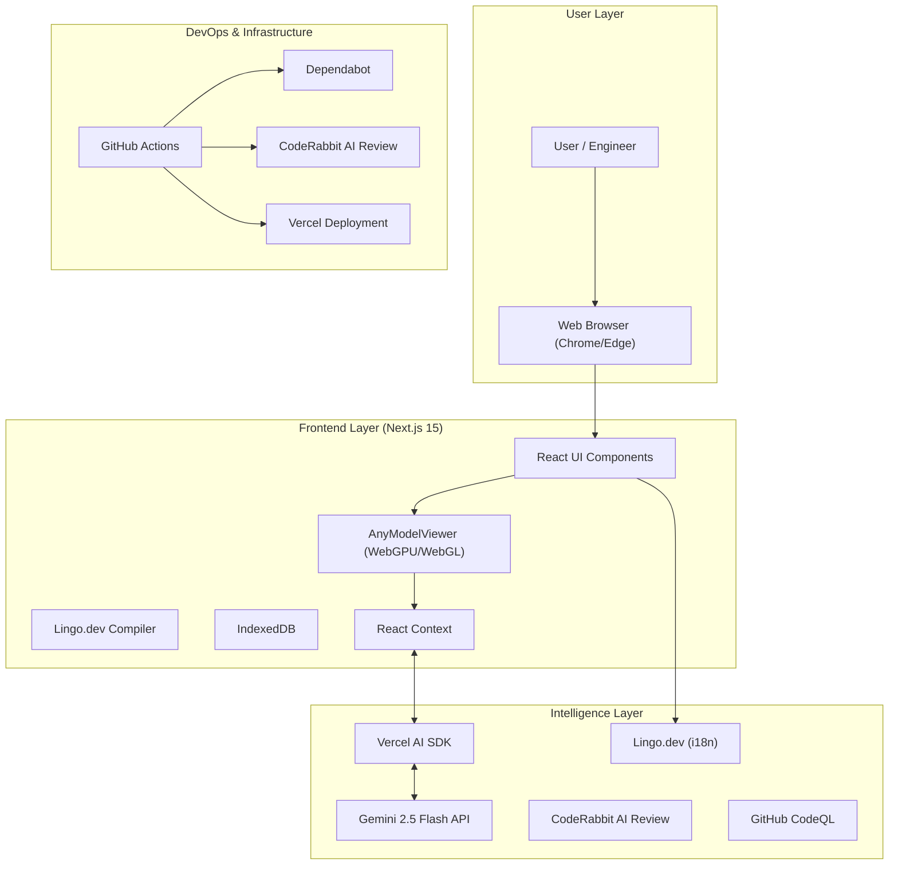
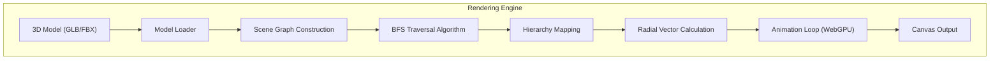
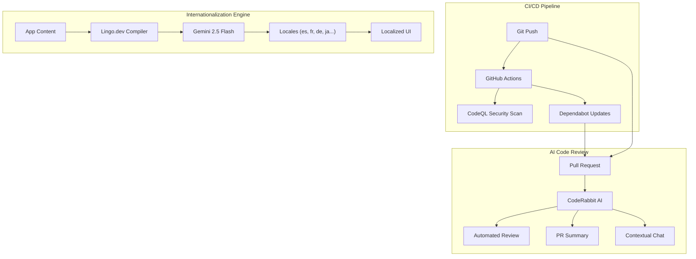
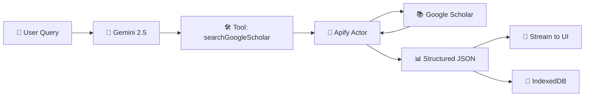

# Three21 🚀

### The "X-Ray Vision" for Engineering Analysis

**Three21** is an intelligent 3D analysis platform that combines **hierarchical spatial decomposition** with **multimodal AI** to revolutionize how engineers understand complex systems.

---

## 🦈 The Pitch (Shark Tank Style)

**"Sharks, imagine you're an engineer trying to understand a complex jet engine or a robotic arm."**

Today, engineers are stuck staring at 2D blueprints or static 3D models. They can't see *inside*. They can't understand *how* it fits together without exploding it manually, which takes hours. It's like trying to learn surgery from a photograph.

**Three21 is the solution.** We use AI and advanced spatial algorithms to *automatically* disassemble any 3D model, layer by layer, preserving the hierarchy. It's not just a viewer; it's an *intelligent analysis platform* that lets you "talk" to the model.

We are here to revolutionize reverse engineering, education, and design review.

---

## 🏆 MLH General Track & Gemini 2.5 Flash Integration

Three21 is built for the **MLH General Track**, showcasing the power of next-gen AI integration.

### Powered by Gemini 2.5 Flash 🧠
We don't just render pixels; we *understand* them.

-   **Vision Capabilities:** The system captures real-time snapshots of the model from multiple angles.
-   **Vision Capabilities:** The system captures real-time snapshots of the model from multiple angles.
-   **Multimodal Analysis:** Gemini 2.5 Flash analyzes these visuals alongside the model's metadata (hierarchy, material names).
-   **Streaming Intelligence:** We use the **Vercel AI SDK** to stream (Server Sent Events SSE) insights in real-time, creating a conversational interface that feels like talking to a senior engineer.

---

## 🏗️ System Design (Layered Architecture)

### Layer 1: High-Level Architecture
How different tech stacks are bundled together to create a cohesive system.



### Layer 2: Rendering Engine (The Core)
The BFS-based hierarchical rendering engine that powers the disassembly.



### Layer 3: DevOps & Intelligence Architecture
How we ensure code quality, security, and global accessibility automatically.



---

## 🌍 Lingo.dev Integration (Global Engineering)

Three21 uses **Lingo.dev** to break language barriers in engineering. Instead of manual translation files, we use AI to generate context-aware translations on the fly.

### How It Works
1.  **Configuration**: We define our target languages (Spanish, French, German, English) in `next.config.mjs`.
2.  **Context Injection**: We provide domain context ("3D Engineering & Reverse Engineering") so the AI knows that "Mesh" means a 3D object, not a fabric network.
3.  **AI Translation**: The `lingoCompiler` in `next.config.mjs` intercepts text and uses **Google Gemini 2.5 Flash** to translate it, preserving technical accuracy.
4.  **Result**: A fully localized engineering platform that speaks the user's technical language.

```json
// lingo.config.json
{
  "sourceLanguage": "en",
  "targetLanguages": ["es", "de", "fr"],
  "context": {
    "domain": "3D Engineering & Reverse Engineering",
    "tone": "professional, technical"
  }
}
```

---

## 🤖 CodeRabbit & Quality Assurance

We employ a suite of automated tools to maintain high code quality and security.

-   **CodeRabbit**: An AI-powered code reviewer that analyzes every Pull Request. It provides:
    -   **Summaries**: High-level overviews of changes.
    -   **Walkthroughs**: Detailed explanations of the code flow.
    -   **Chat**: We can ask it questions about the PR context.
-   **GitHub Dependabot**: Automatically monitors `package.json` and opens PRs for updates, grouped by ecosystem (e.g., `react-ecosystem`, `ai-sdk`) to reduce noise.
-   **CodeQL**: Semantic code analysis engine that scans for security vulnerabilities and coding errors before they merge.

---

---

## 🛠️ Technology Stack

### Core Framework
-   **Next.js 15.4 (App Router)**: The backbone of the application, providing server-side rendering and API routes.
-   **React 19**: Utilizing the latest React features for a responsive UI.

### 3D Rendering & Graphics
-   **Three.js & React Three Fiber**: For high-performance 3D rendering.
-   **WebGPU**: Leveraging next-gen graphics APIs for smooth performance on complex models (with WebGL fallback).
-   **BFS Algorithm**: Custom Breadth-First Search algorithm for hierarchical model decomposition.

### AI & Intelligence
-   **Google Gemini 2.5 Flash**: The brain behind the visual analysis.
-   **Vercel AI SDK**: For streaming AI responses and managing chat state.
-   **CodeRabbit**: AI-powered code reviews to ensure code quality.

### Infrastructure & DevOps
-   **GitHub Dependabot**: Automated dependency updates to keep the project secure.
-   **Vercel**: Seamless deployment and hosting.
-   **Lingo.dev**: Automated internationalization (i18n) to make the tool accessible globally.

### Storage & State
-   **IndexedDB**: Client-side storage for caching large 3D models and chat history, ensuring privacy and performance.
-   **Context**: For efficient state management across components.

### Research & Citations
-   **Apify Google Scholar Actor**: Integrated web scraping for academic research papers, bringing scholarly context directly into the AI conversation.

---

## 📚 Apify Google Scholar Integration

Three21Bot features **real-time academic research integration** powered by Apify's Google Scholar Actor and AI SDK 5.0 tool calling.

### How It Works

When you ask about research topics, the AI:

1. **Understands Intent**: Gemini 2.5 Flash recognizes research requests
2. **Optimizes Query**: Converts natural language to scholarly keywords
3. **Calls Tool**: Invokes `searchGoogleScholar` tool via AI SDK 5.0
4. **Scrapes Scholar**: Apify Actor extracts structured data from Google Scholar
5. **Streams Results**: Papers appear in real-time as interactive cards
6. **Persists Data**: Full results saved to IndexedDB (survives reload)

### Architecture



### Implementation Stack

| Component | Technology | Purpose |
|-----------|-----------|----------|
| **AI Framework** | Vercel AI SDK 5.0 | Tool calling & streaming |
| **LLM** | Google Gemini 2.5 Flash | Query optimization |
| **Web Scraper** | Apify Actor (`kdjLO0hegCjr5Ejqp`) | Google Scholar extraction |
| **Storage** | IndexedDB | Persistent results |
| **UI** | React 19 + Responsive CSS | Cross-device display |

### Example Usage

**User**: `"Find research on quadruped robot locomotion"`

**AI Response**:
```
🔍 Searching Google Scholar...
✓ Complete

📚 Found 10 papers

[1] Wheeled Magnetic Adsorption Climbing Robot...
    Y Chen, P Wang, Y Li... - IEEE Trans., 2024
    📅 2024 | 📖 1 citation
    [View Paper] [Citations] [Related]

[2] Autonomous Quadruped Navigation...
    📅 2023 | 📖 89 citations
...
```

### Features

✅ **Natural Language Queries** - Ask in plain English  
✅ **Real-Time Streaming** - Results appear as they arrive  
✅ **Full Metadata** - Authors, citations, year, publication, links  
✅ **Persistent Storage** - Survives page reload (IndexedDB)  
✅ **Responsive Design** - Mobile, tablet, desktop optimized  
✅ **Direct Links** - Click titles to read papers  
✅ **Citation Tracking** - View citation counts and networks  
✅ **Tool State Display** - Visual feedback ("Searching...", "✓ Complete")

### Configuration

Add to `.env`:

```bash
APIFY_API_KEY=apify_api_xxxxxxxxxxxxxxxxxxxxx
GOOGLE_API_KEY=AIzaSyxxxxxxxxxxxxxxxxxxxxx
```

### Code Example

**Tool Definition** (`app/api/chat/route.js`):

```javascript
import { streamText, tool } from 'ai';
import { z } from 'zod';

tools: {
    searchGoogleScholar: tool({
        description: 'Search Google Scholar for research papers',
        parameters: z.object({
            query: z.string().describe('Scholarly search query'),
            maxItems: z.number().optional().describe('Max results (default 10)'),
            minYear: z.number().optional().describe('Min year (default 2022)')
        }),
        execute: async ({ query, maxItems, minYear }) => {
            const results = await searchGoogleScholar({
                query,
                maxItems: maxItems || 10,
                minYear: minYear || 2022
            });
            
            return {
                query,
                count: results.length,
                results // Full array with metadata
            };
        }
    })
}
```

### Data Structure

Each paper includes:

```javascript
{
    "title": "Wheeled Magnetic Adsorption...",
    "authors": "Y Chen, P Wang, Y Li...",
    "year": 2024,
    "citations": 127,
    "publication": "IEEE/ASME Transactions on Mechatronics",
    "link": "https://ieeexplore.ieee.org/...",
    "searchMatch": "...preview snippet...",
    "citationsLink": "https://scholar.google.com/...",
    "relatedArticlesLink": "https://scholar.google.com/..."
}
```

📖 **Full Documentation**: See [docs/APIFY_INTEGRATION.md](./docs/APIFY_INTEGRATION.md) for detailed architecture, implementation guide, and advanced features.

---

## 🔮 Future Scope

### AP5 Worker Actors
We plan to move heavy geometric calculations (like convex hull generation for collision detection) off the main thread to **AP5 Worker Actors**. This will ensure the UI remains buttery smooth (60 FPS) even when analyzing massive CAD models with millions of polygons.

### Tool Calling & Agentic AI
We are evolving the AI from a chatbot to an **Agent**.
-   **User:** "Show me the fuel pump."
-   **AI:** Calls `zoomToPart('fuel_pump')` tool.
-   **Viewer:** Automatically zooms and highlights the part.

### Research Citations (RAG)
Integrating **RAG (Retrieval-Augmented Generation)** to allow the AI to cite real engineering manuals, research papers, and datasheets, making it a true engineering companion.

---

## 🚀 Getting Started

### Prerequisites
-   Node.js 18+
-   npm or yarn

### Installation

```bash
# Clone the repository
git clone https://github.com/Amon20044/three21.git
cd three21

# Install dependencies
npm install

# Start development server
npm run dev
```

Visit `http://localhost:3000` to see the application.

---

## 📄 License

This project is licensed under the MIT License - see the LICENSE file for details.

- [ ] Export functionality

**v2.0**
- [ ] Multi-model comparison
- [ ] Collaborative viewing
- [ ] VR/AR support
- [ ] Cloud storage integration

---

## 📊 Performance

### Benchmarks (Chrome 113+)

| Metric         | WebGL | WebGPU | Improvement |
|----------------|-------|--------|-------------|
| FPS (idle)     | 60    | 60     | -           |
| FPS (animated) | 45-55 | 55-60  | +18%        |
| CPU Usage      | 25%   | 18%    | -28%        |
| Init Time      | 850ms | 920ms  | +8%         |

*Note: WebGPU has slightly longer initialization but better runtime performance*

---

## 🐛 Known Issues

1. **Safari**: Limited WebGPU support (Technology Preview only)
2. **Firefox**: Requires manual flag enabling for WebGPU
3. **Mobile**: WebGPU support varies by device and OS
4. **Large Models**: May require additional memory on older devices

See GitHub Issues for complete list and workarounds.

---

**Built with ❤️ using Next.js, Three.js, and WebGPU**

For more information, visit the [documentation](./docs/) folder.
