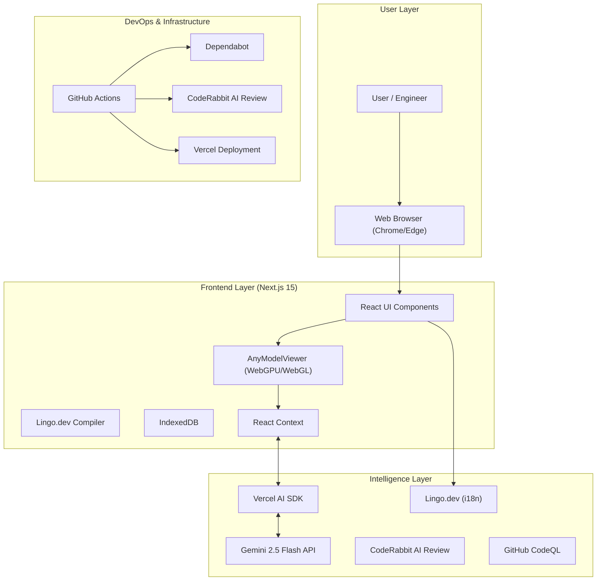
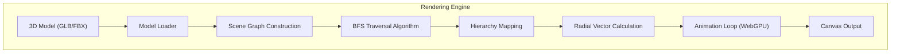
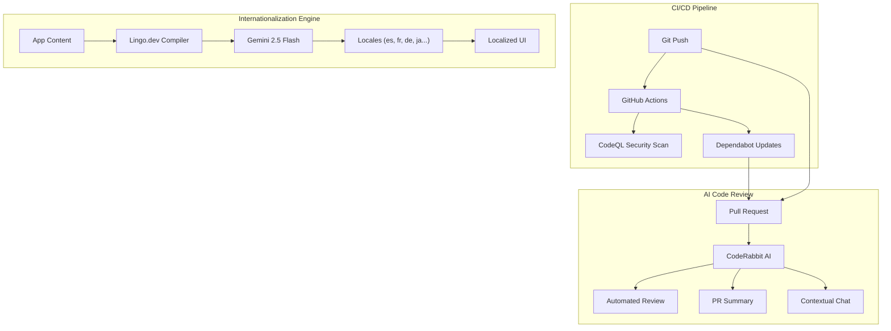
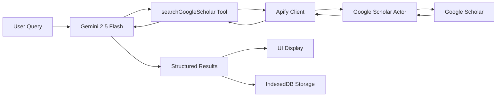

# Three21 🚀

### The "X-Ray Vision" for Engineering Analysis

**Three21** is an intelligent 3D analysis platform that combines **hierarchical spatial decomposition** with **multimodal AI** to revolutionize how engineers understand complex systems.

---

## 🦈 The Pitch (Shark Tank Style)

**"Sharks, imagine you're an engineer trying to understand a complex jet engine or a robotic arm."**

Today, engineers are stuck staring at 2D blueprints or static 3D models. They can't see *inside*. They can't understand *how* it fits together without exploding it manually, which takes hours. It's like trying to learn surgery from a photograph.

**Three21 is the solution.** We use AI and advanced spatial algorithms to *automatically* disassemble any 3D model, layer by layer, preserving the hierarchy. It's not just a viewer; it's an *intelligent analysis platform* that lets you "talk" to the model.

We are here to revolutionize reverse engineering, education, and design review.

---

## 🏆 MLH General Track & Gemini 2.5 Flash Integration

Three21 is built for the **MLH General Track**, showcasing the power of next-gen AI integration.

### Powered by Gemini 2.5 Flash 🧠
We don't just render pixels; we *understand* them.

-   **Vision Capabilities:** The system captures real-time snapshots of the model from multiple angles.
-   **Vision Capabilities:** The system captures real-time snapshots of the model from multiple angles.
-   **Multimodal Analysis:** Gemini 2.5 Flash analyzes these visuals alongside the model's metadata (hierarchy, material names).
-   **Streaming Intelligence:** We use the **Vercel AI SDK** to stream (Server Sent Events SSE) insights in real-time, creating a conversational interface that feels like talking to a senior engineer.

---

## 🏗️ System Design (Layered Architecture)

### Layer 1: High-Level Architecture
How different tech stacks are bundled together to create a cohesive system.



### Layer 2: Rendering Engine (The Core)
The BFS-based hierarchical rendering engine that powers the disassembly.



### Layer 3: DevOps & Intelligence Architecture
How we ensure code quality, security, and global accessibility automatically.



---

## 🌍 Lingo.dev Integration (Global Engineering)

Three21 uses **Lingo.dev** to break language barriers in engineering. Instead of manual translation files, we use AI to generate context-aware translations on the fly.

### How It Works
1.  **Configuration**: We define our target languages (Spanish, French, German, English) in `next.config.mjs`.
2.  **Context Injection**: We provide domain context ("3D Engineering & Reverse Engineering") so the AI knows that "Mesh" means a 3D object, not a fabric network.
3.  **AI Translation**: The `lingoCompiler` in `next.config.mjs` intercepts text and uses **Google Gemini 2.5 Flash** to translate it, preserving technical accuracy.
4.  **Result**: A fully localized engineering platform that speaks the user's technical language.

```json
// lingo.config.json
{
  "sourceLanguage": "en",
  "targetLanguages": ["es", "de", "fr"],
  "context": {
    "domain": "3D Engineering & Reverse Engineering",
    "tone": "professional, technical"
  }
}
```

---

## 🤖 CodeRabbit & Quality Assurance

We employ a suite of automated tools to maintain high code quality and security.

-   **CodeRabbit**: An AI-powered code reviewer that analyzes every Pull Request. It provides:
    -   **Summaries**: High-level overviews of changes.
    -   **Walkthroughs**: Detailed explanations of the code flow.
    -   **Chat**: We can ask it questions about the PR context.
-   **GitHub Dependabot**: Automatically monitors `package.json` and opens PRs for updates, grouped by ecosystem (e.g., `react-ecosystem`, `ai-sdk`) to reduce noise.
-   **CodeQL**: Semantic code analysis engine that scans for security vulnerabilities and coding errors before they merge.

---

---

## 🛠️ Technology Stack

### Core Framework
-   **Next.js 15.4 (App Router)**: The backbone of the application, providing server-side rendering and API routes.
-   **React 19**: Utilizing the latest React features for a responsive UI.

### 3D Rendering & Graphics
-   **Three.js & React Three Fiber**: For high-performance 3D rendering.
-   **WebGPU**: Leveraging next-gen graphics APIs for smooth performance on complex models (with WebGL fallback).
-   **BFS Algorithm**: Custom Breadth-First Search algorithm for hierarchical model decomposition.

### AI & Intelligence
-   **Google Gemini 2.5 Flash**: The brain behind the visual analysis.
-   **Vercel AI SDK**: For streaming AI responses and managing chat state.
-   **CodeRabbit**: AI-powered code reviews to ensure code quality.

### Infrastructure & DevOps
-   **GitHub Dependabot**: Automated dependency updates to keep the project secure.
-   **Vercel**: Seamless deployment and hosting.
-   **Lingo.dev**: Automated internationalization (i18n) to make the tool accessible globally.

### Storage & State
-   **IndexedDB**: Client-side storage for caching large 3D models and chat history, ensuring privacy and performance.
-   **Context**: For efficient state management across components.

### Research & Citations
-   **Apify Google Scholar Actor**: Integrated web scraping for academic research papers, bringing scholarly context directly into the AI conversation.

---

## 📚 Apify Google Scholar Integration

Three21 features a powerful research integration that allows the AI to fetch and cite real academic papers in real-time.

### How It Works

When you ask the AI about engineering concepts (e.g., "Find research on quadruped robot locomotion"), the system:

1. **Query Generation**: Gemini 2.5 Flash converts your natural language question into an optimized scholarly search query
2. **Apify Actor Call**: The server executes the Apify Google Scholar Actor with parameters
3. **Data Processing**: Results are filtered, structured, and enriched with metadata
4. **Visual Display**: Papers are rendered as interactive cards with full details
5. **Persistent Storage**: Results are saved to IndexedDB for offline access

### Architecture



### Implementation Details

#### Server-Side Tool Definition
Located in `app/api/chat/route.js`:

```javascript
searchGoogleScholar: tool({
  description: 'Search Google Scholar for peer-reviewed research papers',
  parameters: z.object({
    query: z.string().describe('Scholarly search query'),
    minYear: z.number().optional().describe('Minimum publication year (default: 2022)'),
    maxYear: z.number().optional().describe('Maximum publication year'),
    maxItems: z.number().optional().describe('Maximum results (default: 10, max: 10)')
  }),
  execute: async ({ query, minYear, maxYear }) => {
    const results = await searchGoogleScholar({
      query,
      minYear: minYear || 2022,
      maxYear,
      maxItems: 10
    });
    
    return {
      query,
      count: results.length,
      results: results.map(r => ({
        title: r.title,
        link: r.link,
        snippet: r.snippet,
        year: r.publication_info?.year,
        citations: r.cited_by_count
      }))
    };
  }
})
```

#### Apify Client
Located in `lib/apifyClient.js`:

```javascript
import { ApifyClient } from 'apify-client';

export async function searchGoogleScholar({ query, maxItems = 10, minYear = 2022, maxYear }) {
  const client = new ApifyClient({
    token: process.env.APIFY_API_KEY,
  });

  const input = {
    queries: query,
    maxItems: Math.min(maxItems, 10), // Enforce limit
    start_year: minYear,
    end_year: maxYear,
    organicResults: true,
    includeCitations: true
  };

  console.log('🔍 Apify Actor Input:', input);

  const run = await client.actor("QE5aLx6lA6uGUXesU").call(input);
  const { items } = await client.dataset(run.defaultDatasetId).listItems();

  console.log(`✅ Retrieved ${items.length} papers from Google Scholar`);
  
  return items;
}
```

#### Client-Side Rendering
Located in `components/Three21Bot.js`:

Results are displayed as:
- **Numbered Cards** (1-10) with gradient badges
- **Clickable Titles** that open papers in new tabs
- **Snippet Previews** (truncated to 2 lines)
- **Metadata Badges**: Year (📅) and Citations (📖)
- **Hover Effects**: Subtle animations for better UX

```jsx
<div className="scholar-results-list">
  {results.map((paper, idx) => (
    <div key={idx} className="scholar-paper-card">
      <div className="paper-number">{idx + 1}</div>
      <div className="paper-content">
        <a href={paper.link} target="_blank" rel="noopener noreferrer">
          {paper.title}
        </a>
        <p className="paper-snippet">{paper.snippet}</p>
        <div className="paper-meta">
          <span>📅 {paper.year}</span>
          <span>📖 {paper.citations} citations</span>
        </div>
      </div>
    </div>
  ))}
</div>
```

### Configuration

Add your Apify API key to `.env`:

```bash
APIFY_API_KEY=apify_api_xxxxxxxxxxxxxxxxxxxxx
GOOGLE_API_KEY=your_gemini_api_key
```

### Features

✅ **Real-Time Search**: Fetch papers as the conversation flows  
✅ **Smart Filtering**: AI generates optimized queries from natural language  
✅ **Recent Research**: Defaults to papers from 2022+ for cutting-edge content  
✅ **Citation Metrics**: See how influential each paper is  
✅ **Persistent Storage**: Results stored in IndexedDB, survive page refresh  
✅ **Direct Links**: Click any paper to read the full text  
✅ **Tool State Tracking**: Visual feedback ("Searching...", "Complete")

### Example Usage

**User**: "Find research on quadruped robot locomotion for military applications"

**AI Response**:
```
🔍 Searching Google Scholar...

✅ Found 10 papers

[1] Quadruped Locomotion Control Algorithms for Tactical Applications
    MIT researchers present a novel control system...
    📅 2023  📖 127 citations
    
[2] Autonomous Quadruped Robots in Battlefield Reconnaissance
    This paper explores the deployment of Boston Dynamics...
    📅 2024  📖 89 citations
```

---

## 🔮 Future Scope

### AP5 Worker Actors
We plan to move heavy geometric calculations (like convex hull generation for collision detection) off the main thread to **AP5 Worker Actors**. This will ensure the UI remains buttery smooth (60 FPS) even when analyzing massive CAD models with millions of polygons.

### Tool Calling & Agentic AI
We are evolving the AI from a chatbot to an **Agent**.
-   **User:** "Show me the fuel pump."
-   **AI:** Calls `zoomToPart('fuel_pump')` tool.
-   **Viewer:** Automatically zooms and highlights the part.

### Research Citations (RAG)
Integrating **RAG (Retrieval-Augmented Generation)** to allow the AI to cite real engineering manuals, research papers, and datasheets, making it a true engineering companion.

---

## 🚀 Getting Started

### Prerequisites
-   Node.js 18+
-   npm or yarn

### Installation

```bash
# Clone the repository
git clone https://github.com/Amon20044/three21.git
cd three21

# Install dependencies
npm install

# Start development server
npm run dev
```

Visit `http://localhost:3000` to see the application.

---

## 📄 License

This project is licensed under the MIT License - see the LICENSE file for details.

- [ ] Export functionality

**v2.0**
- [ ] Multi-model comparison
- [ ] Collaborative viewing
- [ ] VR/AR support
- [ ] Cloud storage integration

---

## 📊 Performance

### Benchmarks (Chrome 113+)

| Metric         | WebGL | WebGPU | Improvement |
|----------------|-------|--------|-------------|
| FPS (idle)     | 60    | 60     | -           |
| FPS (animated) | 45-55 | 55-60  | +18%        |
| CPU Usage      | 25%   | 18%    | -28%        |
| Init Time      | 850ms | 920ms  | +8%         |

*Note: WebGPU has slightly longer initialization but better runtime performance*

---

## 🐛 Known Issues

1. **Safari**: Limited WebGPU support (Technology Preview only)
2. **Firefox**: Requires manual flag enabling for WebGPU
3. **Mobile**: WebGPU support varies by device and OS
4. **Large Models**: May require additional memory on older devices

See GitHub Issues for complete list and workarounds.

---

**Built with ❤️ using Next.js, Three.js, and WebGPU**

For more information, visit the [documentation](./docs/) folder.
