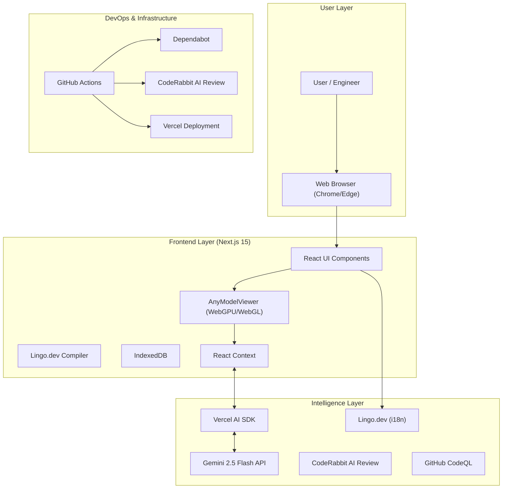
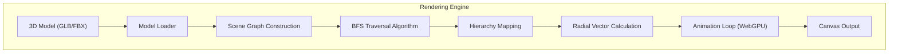
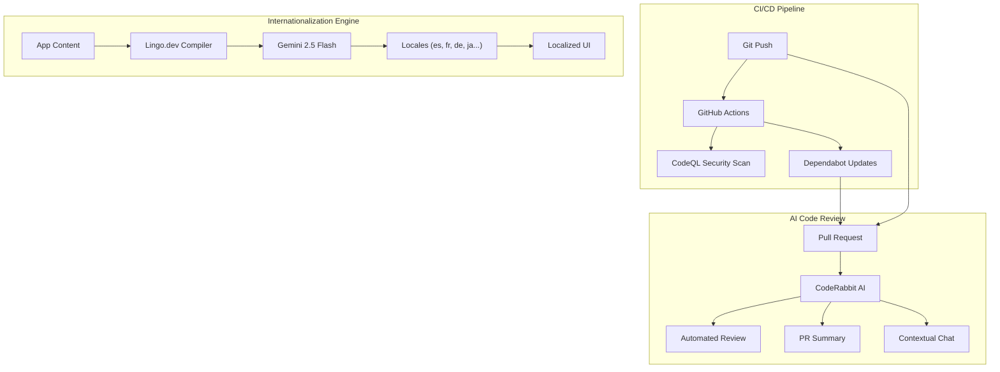
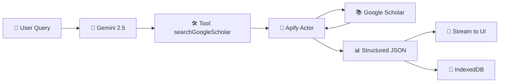

# Three21 🚀

### The "X-Ray Vision" for Engineering Analysis

**Three21** is an intelligent 3D analysis platform that combines **hierarchical spatial decomposition** with **multimodal AI** to revolutionize how engineers understand complex systems.

---

## 🦈 The Pitch (Shark Tank Style)

**"Sharks, imagine you're an engineer trying to understand a complex jet engine or a robotic arm."**

Today, engineers are stuck staring at 2D blueprints or static 3D models. They can't see *inside*. They can't understand *how* it fits together without exploding it manually, which takes hours. It's like trying to learn surgery from a photograph.

**Three21 is the solution.** We use AI and advanced spatial algorithms to *automatically* disassemble any 3D model, layer by layer, preserving the hierarchy. It's not just a viewer; it's an *intelligent analysis platform* that lets you "talk" to the model.

We are here to revolutionize reverse engineering, education, and design review.

---

## 🏆 MLH General Track & Gemini 2.5 Flash Integration

Three21 is built for the **MLH General Track**, showcasing the power of next-gen AI integration.

### Powered by Gemini 2.5 Flash 🧠
We don't just render pixels; we *understand* them.

-   **Vision Capabilities:** The system captures real-time snapshots of the model from multiple angles.
-   **Vision Capabilities:** The system captures real-time snapshots of the model from multiple angles.
-   **Multimodal Analysis:** Gemini 2.5 Flash analyzes these visuals alongside the model's metadata (hierarchy, material names).
-   **Streaming Intelligence:** We use the **Vercel AI SDK** to stream (Server Sent Events SSE) insights in real-time, creating a conversational interface that feels like talking to a senior engineer.

---

## 🏗️ System Design (Layered Architecture)

### Layer 1: High-Level Architecture
How different tech stacks are bundled together to create a cohesive system.



### Layer 2: Rendering Engine (The Core)
The BFS-based hierarchical rendering engine that powers the disassembly.



### Layer 3: DevOps & Intelligence Architecture
How we ensure code quality, security, and global accessibility automatically.



---

## 🌍 Lingo.dev Integration (Global Engineering)

Three21 uses **Lingo.dev** to break language barriers in engineering. Instead of manual translation files, we use AI to generate context-aware translations on the fly.

### How It Works
1.  **Configuration**: We define our target languages (Spanish, French, German, English) in `next.config.mjs`.
2.  **Context Injection**: We provide domain context ("3D Engineering & Reverse Engineering") so the AI knows that "Mesh" means a 3D object, not a fabric network.
3.  **AI Translation**: The `lingoCompiler` in `next.config.mjs` intercepts text and uses **Google Gemini 2.5 Flash** to translate it, preserving technical accuracy.
4.  **Result**: A fully localized engineering platform that speaks the user's technical language.

```json
// lingo.config.json
{
  "sourceLanguage": "en",
  "targetLanguages": ["es", "de", "fr"],
  "context": {
    "domain": "3D Engineering & Reverse Engineering",
    "tone": "professional, technical"
  }
}
```

---

## 🤖 CodeRabbit & Quality Assurance

We employ a suite of automated tools to maintain high code quality and security.

-   **CodeRabbit**: An AI-powered code reviewer that analyzes every Pull Request. It provides:
    -   **Summaries**: High-level overviews of changes.
    -   **Walkthroughs**: Detailed explanations of the code flow.
    -   **Chat**: We can ask it questions about the PR context.
-   **GitHub Dependabot**: Automatically monitors `package.json` and opens PRs for updates, grouped by ecosystem (e.g., `react-ecosystem`, `ai-sdk`) to reduce noise.
-   **CodeQL**: Semantic code analysis engine that scans for security vulnerabilities and coding errors before they merge.

---

---

## 🛠️ Technology Stack

### Core Framework
-   **Next.js 15.4 (App Router)**: The backbone of the application, providing server-side rendering and API routes.
-   **React 19**: Utilizing the latest React features for a responsive UI.

### 3D Rendering & Graphics
-   **Three.js & React Three Fiber**: For high-performance 3D rendering.
-   **WebGPU**: Leveraging next-gen graphics APIs for smooth performance on complex models (with WebGL fallback).
-   **BFS Algorithm**: Custom Breadth-First Search algorithm for hierarchical model decomposition.

### AI & Intelligence
-   **Google Gemini 2.5 Flash**: The brain behind the visual analysis.
-   **Vercel AI SDK**: For streaming AI responses and managing chat state.
-   **CodeRabbit**: AI-powered code reviews to ensure code quality.

### Infrastructure & DevOps
-   **GitHub Dependabot**: Automated dependency updates to keep the project secure.
-   **Vercel**: Seamless deployment and hosting.
-   **Lingo.dev**: Automated internationalization (i18n) to make the tool accessible globally.

### Storage & State
-   **IndexedDB**: Client-side storage for caching large 3D models and chat history, ensuring privacy and performance.
-   **Context**: For efficient state management across components.

### Research & Citations
-   **Apify Google Scholar Actor**: Integrated web scraping for academic research papers, bringing scholarly context directly into the AI conversation.

---

## 📚 Apify Google Scholar Integration

Three21Bot features **real-time academic research integration** powered by Apify's Google Scholar Actor and AI SDK 5.0 tool calling.

### How It Works

When you ask about research topics, the AI:

1. **Understands Intent**: Gemini 2.5 Flash recognizes research requests
2. **Optimizes Query**: Converts natural language to scholarly keywords
3. **Calls Tool**: Invokes `searchGoogleScholar` tool via AI SDK 5.0
4. **Scrapes Scholar**: Apify Actor extracts structured data from Google Scholar
5. **Streams Results**: Papers appear in real-time as interactive cards
6. **Persists Data**: Full results saved to IndexedDB (survives reload)

### Architecture



### Implementation Stack

| Component | Technology | Purpose |
|-----------|-----------|----------|
| **AI Framework** | Vercel AI SDK 5.0 | Tool calling & streaming |
| **LLM** | Google Gemini 2.5 Flash | Query optimization |
| **Web Scraper** | Apify Actor (`kdjLO0hegCjr5Ejqp`) | Google Scholar extraction |
| **Storage** | IndexedDB | Persistent results |
| **UI** | React 19 + Responsive CSS | Cross-device display |

### Example Usage

**User**: `"Find research on quadruped robot locomotion"`

**AI Response**:
```
🔍 Searching Google Scholar...
✓ Complete

📚 Found 10 papers

[1] Wheeled Magnetic Adsorption Climbing Robot...
    Y Chen, P Wang, Y Li... - IEEE Trans., 2024
    📅 2024 | 📖 1 citation
    [View Paper] [Citations] [Related]

[2] Autonomous Quadruped Navigation...
    📅 2023 | 📖 89 citations
...
```

### Features

✅ **Natural Language Queries** - Ask in plain English  
✅ **Real-Time Streaming** - Results appear as they arrive  
✅ **Full Metadata** - Authors, citations, year, publication, links  
✅ **Persistent Storage** - Survives page reload (IndexedDB)  
✅ **Responsive Design** - Mobile, tablet, desktop optimized  
✅ **Direct Links** - Click titles to read papers  
✅ **Citation Tracking** - View citation counts and networks  
✅ **Tool State Display** - Visual feedback ("Searching...", "✓ Complete")

### Configuration

Add to `.env`:

```bash
APIFY_API_KEY=apify_api_xxxxxxxxxxxxxxxxxxxxx
GOOGLE_API_KEY=AIzaSyxxxxxxxxxxxxxxxxxxxxx
```

### Code Example

**Tool Definition** (`app/api/chat/route.js`):

```javascript
import { streamText, tool } from 'ai';
import { z } from 'zod';

tools: {
    searchGoogleScholar: tool({
        description: 'Search Google Scholar for research papers',
        parameters: z.object({
            query: z.string().describe('Scholarly search query'),
            maxItems: z.number().optional().describe('Max results (default 10)'),
            minYear: z.number().optional().describe('Min year (default 2022)')
        }),
        execute: async ({ query, maxItems, minYear }) => {
            const results = await searchGoogleScholar({
                query,
                maxItems: maxItems || 10,
                minYear: minYear || 2022
            });
            
            return {
                query,
                count: results.length,
                results // Full array with metadata
            };
        }
    })
}
```

### Data Structure

Each paper includes:

```javascript
{
    "title": "Wheeled Magnetic Adsorption...",
    "authors": "Y Chen, P Wang, Y Li...",
    "year": 2024,
    "citations": 127,
    "publication": "IEEE/ASME Transactions on Mechatronics",
    "link": "https://ieeexplore.ieee.org/...",
    "searchMatch": "...preview snippet...",
    "citationsLink": "https://scholar.google.com/...",
    "relatedArticlesLink": "https://scholar.google.com/..."
}
```

📖 **Full Documentation**: See [docs/APIFY_INTEGRATION.md](./docs/APIFY_INTEGRATION.md) for detailed architecture, implementation guide, and advanced features.

---

## 🔮 Future Scope - The Vision

### 🔐 Phase 1: Cloud Sync & User Accounts

**Problem**: Users lose data when switching devices, no collaboration possible

**Solution**:
- **OAuth 2.0 Login**: Google, GitHub, Microsoft SSO
- **End-to-End Encryption**: Model data encrypted before upload
- **Selective Sync**: Choose which models to back up
- **Version Control**: Track model iterations over time
- **Cross-Device**: Start analysis on desktop, finish on tablet
- **Team Sharing**: Invite colleagues to view/edit models

---

### 🏪 Phase 2: 3D Model Marketplace

**Vision**: GitHub meets Thingiverse for Engineering Analysis

**Features**:
- 📤 **Upload & Share** analyzed models with annotations
- 🔍 **Discover** curated engineering models by category
- 🍴 **Fork & Clone**: Build on community work
- ⭐ **Ratings & Reviews**: Quality-driven discovery
- 🏷️ **Tags**: Automotive, Aerospace, Medical Devices, Robotics, Consumer Products
- 📜 **Licensing**: Creative Commons, Commercial, Educational-only
- 💰 **Monetization**: Sell premium models (15% platform fee)

**Example Listings**:
```
🦾 KUKA KR 16-2 Robotic Arm (Analysis Included)
   By: @robotics_engineer
   ⭐ 4.9 (127 reviews) | 📥 2,300 downloads
   🏷️ Industrial, 6-DOF, Servo Motors
   💵 $49 (Commercial License)
   
🚗 Tesla Model S Rear Motor Assembly
   By: @ev_teardown_lab
   ⭐ 4.8 (89 reviews) | 📥 1,800 downloads
   🏷️ Automotive, Electric Powertrain
   🆓 Free (Educational Use)
```

---

### 🎓 Phase 3: Student Workspaces & Education Platform

**Transform Engineering Education**

#### Virtual Laboratory System
- **Guided Experiments**: Step-by-step teardown tutorials
- **Progressive Difficulty**: Beginner → Intermediate → Expert levels
- **Auto-Grading**: AI checks if student identified parts correctly
- **Certification**: Earn badges for completing lab modules
- **Custom Curriculum**: Professors design their own lab sequences

#### Classroom Management
- **Teacher Dashboard**: Monitor 30+ students in real-time
- **Assignments**: "Analyze this gearbox, submit by Friday 11:59 PM"
- **Grading Assistant**: AI pre-grades, teacher reviews for accuracy
- **Plagiarism Detection**: Compare student analyses for originality
- **Performance Analytics**: Track class comprehension trends

#### Special School Accounts
- 🏫 **Bulk Licensing**: $500/year for unlimited student seats
- 👨‍🏫 **Admin Controls**: Teachers manage student access
- 📋 **FERPA Compliant**: Student data protection built-in
- 🔗 **LMS Integration**: Canvas, Blackboard, Moodle, Google Classroom

#### Collaborative Study Groups
- **Group Workspaces**: 4-6 students analyze same model together
- **Real-Time Cursors**: See what teammates are examining
- **Voice Chat**: Discuss findings while exploring (like Discord)
- **Shared Annotations**: Mark interesting features collectively
- **Session Recording**: Replay the analysis session later

**Target Impact**:
- 🏫 1,000+ universities by Year 2
- 👨‍🎓 100,000+ students learning with Three21
- 📈 85% improvement in 3D comprehension (vs traditional 2D instruction)

---

### 🤖 Phase 4: Multi-Vision AI Model Integration

**Vision**: Best AI for Every Task

**Current**: Gemini 2.5 Flash (jack of all trades)  
**Future**: Specialized models optimized for specific domains

| Use Case | Model | Why? |
|----------|-------|------|
| **General Chat** | Gemini 2.5 Flash | Fast, cheap, multimodal |
| **CAD Deep Analysis** | GPT-4 Vision Turbo | Best technical accuracy |
| **Medical Devices** | Claude 3.5 Opus | Safety-critical reasoning |
| **PCB Analysis** | Custom YOLOv8 CNN | Component detection (fine-tuned) |
| **Material Science** | Gemini 2.0 Ultra | Long context (100k tokens for datasheets) |
| **Manufacturing** | Custom Gemma 2 | DFM (Design for Manufacturing) rules |
| **Research Papers** | Perplexity Pro | Real-time web + citations |

**User Controls**:
```
Settings → AI Models
├─ General Analysis: [Gemini 2.5 Flash ▼]  $0.001/query
├─ Vision Analysis: [GPT-4 Vision ▼]       $0.05/query
├─ Research: [Perplexity Pro ▼]            $0.02/query
├─ Manufacturing: [Custom Gemma 2 ▼]      $0.005/query
└─ Monthly Budget: [────○──────] $50
```

**Smart Routing**: AI automatically picks best model based on query type

---

### 🌳 Phase 5: 3D Node Tree UI (Revolutionary UX)

**Problem**: Chat hides which part you're discussing - context gets lost

**Solution**: Visual Node Graph where Every Chat Message = Node on Part

```
         [Model Root]
              |
    ┌─────────┴─────────┐
    |                   |
[Chassis]          [Powertrain]
    |                   |
  [Frame]      ┌────────┴────────┐
    |          |                 |
[Left Rail] [Engine]        [Transmission]
                |
          ┌─────┴─────┐
          |           |
     [Block]    [Cylinder Head]
          |              ↓
      [ 🗨️ "Cast aluminum, likely A380 alloy..." ]
```

**Features**:
- **Auto-Generation**: AI builds tree from model hierarchy
- **Visual Chat**: Responses appear as bubbles on relevant nodes
- **Zoom & Pan**: Explore tree like a map
- **Filter**: "Show only discussed parts"
- **Search**: "Find all bearings" → Highlights nodes in tree
- **Persistent**: Reload page → tree structure intact
- **Export**: PNG, SVG, JSON, PDF report
- **Compare Trees**: Side-by-side for before/after analysis

**Technical Stack**: React Flow + D3.js + WebWorkers

**Use Case**:
1. User clicks **[Cylinder Head]** node
2. Tree expands showing children:
   - Intake Valve (x4)
   - Exhaust Valve (x4)  
   - Spark Plug Hole
   - Coolant Passages
3. User asks: "What material is this?"
4. AI response appears as chat bubble **attached to [Cylinder Head]**
5. **Forever preserved** in tree - never lost in chat scroll!

---

### 🥽 Phase 6: AR/VR Integration

**Vision**: Step Inside Your Model

**Meta Quest 3 Support**:
- Walk around exploded model in 3D space
- Grab parts with hand tracking
- Scale model up to room-size
- Persistent spatial anchors

**Apple Vision Pro Support**:
- Spatial computing for analysis
- Place model on real desk
- Pinch-to-zoom gestures
- Eye tracking for UI

**Features**:
- **Multi-user VR**: 4 engineers in same virtual space
- **Voice commands**: "Show me the transmission"
- **Annotations in 3D**: Place notes that float in space
- **Recording**: Save VR session as video

---

### 🎨 Phase 7: Generative Design AI

**Vision**: AI as Design Partner

**Topology Optimization**:
- Input: "Reduce weight by 30%, maintain 80% strength"
- Output: Organic, bio-inspired structure
- Constraints: Manufacturing method (CNC, 3D print, injection mold)

**Parametric Generation**:
- "Generate 10 bracket variations with different hole patterns"
- AI explores design space automatically
- Rank by: Cost, Weight, Strength, Manufacturability

**Smart Recommendations**:
- "This fillet radius is too tight for injection molding"
- "Consider adding ribs here for stiffness"
- "Wall thickness below minimum for FDM printing"

---

### 👥 Phase 8: Real-Time Collaboration

**Vision**: Google Docs for 3D Models

**Features**:
- **10+ simultaneous users** on same model
- **Live cursors**: See where teammates are looking
- **Voice chat integrated** (like Discord)
- **Annotations persist**: Leave notes for next shift
- **Version history**: Rewind to yesterday's analysis
- **Conflict resolution**: Merge different explorations
- **Permissions**: Owner, Editor, Viewer roles

**Use Case**: 
Aerospace team analyzes satellite antenna:
- **Electrical engineer** checks RF paths
- **Mechanical engineer** reviews mounting
- **Thermal engineer** analyzes heat dissipation
- **All at the same time**, discussing in voice chat

---

### 📄 Phase 9: PDF Technical Report Generator

**Vision**: Auto-Generate Engineering Documentation

**Inputs**: Your Three21 analysis session  
**Output**: Professional 20-page technical report

**Includes**:
- Executive summary (AI-generated)
- Annotated screenshots (auto-captured)
- Material identification table  
- Manufacturing analysis
- Cost estimation
- Bill of Materials (BOM)
- Comparison to similar products
- Research citations (from Google Scholar)
- Appendices (full chat transcript)

**Export Formats**:
- PDF (IEEE/ASME style)
- Microsoft Word (.docx)
- LaTeX (.tex) for academic papers
- HTML (web publishing)

**Templates**:
- Research Paper
- Product Teardown  
- Reverse Engineering Report
- Patent Prior Art Search
- Manufacturing Feasibility Study

---

### 🏭 Phase 10: IoT & Manufacturing Integration

**Connect Digital to Physical**

**3D Printer Integration**:
- Upload model → Slice → Send to Prusa, Bambu, etc.
- Monitor print progress in Three21
- Failure detection (AI watches webcam)

**CNC Export**:
- Generate G-code from analyzed models
- Simulate toolpaths in 3D
- Export to Fusion 360, SolidCAM

**Sensor Data Import**:
- Load real-world stress test results
- Overlay temperature gradients on model
- Compare simulation vs. reality

**Digital Twin**:
- Link Three21 model to physical product
- Track wear over time
- Predictive maintenance alerts

---

### 🏢 Phase 11: Enterprise Features

**For Defense, Aerospace, Automotive**

**Security & Compliance**:
- 🔐 **SSO**: SAML, LDAP, Active Directory
- 🔍 **Audit Logs**: Track who accessed classified models
- 🛡️ **IP Protection**: Watermarking, DRM, access expiry
- 🏢 **On-Premise Deploy**: For defense contractors (ITAR compliance)
- 🔒 **FedRAMP Certification**: Government cloud approval

**Advanced Features**:
- **API Access**: Integrate with PLM systems (Windchill, Teamcenter)
- **Custom AI Models**: Train on proprietary data
- **White-Label**: Rebrand Three21 as your tool
- **Dedicated Support**: 24/7 phone + Slack channel
- **SLA Guarantees**: 99.9% uptime commitment

**Pricing**: Custom quotes starting at $50k/year

---

### 📊 Market Opportunity

**Total Addressable Market (TAM)**:
- Engineering Students: 2.5M (US) → **$125M/year**
- Professional Engineers: 1.7M (US) → **$510M/year**  
- Universities: 4,000 (global) → **$200M/year**
- Manufacturing Companies: 10,000+ → **$1B/year**

**Total TAM**: **$1.8 Billion/year** (US + EU + Asia)

**Competitive Advantage**:
| Competitor | Weakness | Our Edge |
|-----------|----------|----------|
| Autodesk Fusion 360 | No AI, Manual | AI-Powered Auto-Analysis |
| SolidWorks | $4,000/year | Freemium + $9/mo Pro |
| Onshape | Privacy Concerns | Local-First Architecture |
| GrabCAD | Just Hosting | Full Intelligence Layer |

---

## 🚀 Getting Started

### Prerequisites
-   Node.js 18+
-   npm or yarn

### Installation

```bash
# Clone the repository
git clone https://github.com/Amon20044/three21.git
cd three21

# Install dependencies
npm install

# Start development server
npm run dev
```

Visit `http://localhost:3000` to see the application.

---

## 📄 License

This project is licensed under the MIT License - see the LICENSE file for details.

- [ ] Export functionality

**v2.0**
- [ ] Multi-model comparison
- [ ] Collaborative viewing
- [ ] VR/AR support
- [ ] Cloud storage integration

---

## 📊 Performance

### Benchmarks (Chrome 113+)

| Metric         | WebGL | WebGPU | Improvement |
|----------------|-------|--------|-------------|
| FPS (idle)     | 60    | 60     | -           |
| FPS (animated) | 45-55 | 55-60  | +18%        |
| CPU Usage      | 25%   | 18%    | -28%        |
| Init Time      | 850ms | 920ms  | +8%         |

*Note: WebGPU has slightly longer initialization but better runtime performance*

---

## 🐛 Known Issues

1. **Safari**: Limited WebGPU support (Technology Preview only)
2. **Firefox**: Requires manual flag enabling for WebGPU
3. **Mobile**: WebGPU support varies by device and OS
4. **Large Models**: May require additional memory on older devices

See GitHub Issues for complete list and workarounds.

---

**Built with ❤️ using Next.js, Three.js, and WebGPU**

For more information, visit the [documentation](./docs/) folder.
