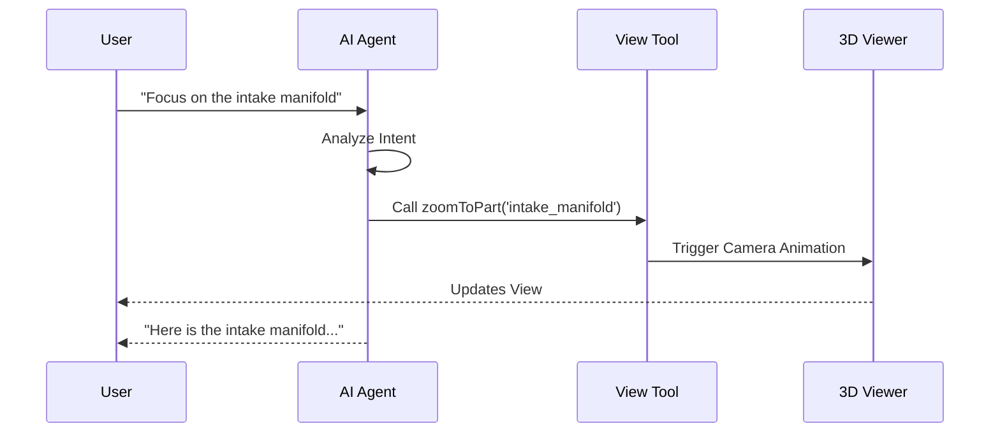

# Three21: The Future of 3D Engineering Analysis 🚀

## Slide 1: The Hook (Shark Tank Pitch) 🦈

**"Sharks, imagine you're an engineer trying to understand a complex jet engine or a robotic arm."**

*   **The Problem:** Today, you're stuck staring at 2D blueprints or static 3D models. You can't see *inside*. You can't understand *how* it fits together without exploding it manually, which takes hours. It's like trying to learn surgery from a photograph.
*   **The Solution:** Enter **Three21**. We are the "X-Ray Vision" for engineering. We use AI and advanced spatial algorithms to *automatically* disassemble any 3D model, layer by layer, preserving the hierarchy. It's not just a viewer; it's an *intelligent analysis platform*.
*   **The Ask:** We're here to revolutionize how engineers learn, analyze, and reverse-engineer complex systems.

---

## Slide 2: The "MLS Track" & Gemini 2.5 Flash 🧠

**"Powered by the Next Generation of AI"**

*   **Gemini 2.5 Flash Integration:** We don't just render pixels; we *understand* them.
    *   **Vision Capabilities:** We take snapshots of the model from multiple angles.
    *   **Multimodal Analysis:** Gemini 2.5 Flash analyzes these visuals alongside the model's metadata (hierarchy, material names).
    *   **Result:** You can ask, "What is this part?" or "How do I manufacture this?" and get an answer based on *visual* and *structural* context.
*   **Streaming Intelligence:** Responses aren't static. We use **Vercel AI SDK** to stream insights in real-time, just like a conversation with a senior engineer.

---

## Slide 3: High-Level System Design (Layer 1) 🏗️

**"How We Build the Future"**

```mermaid
graph TD
    subgraph "User Layer"
        User[User / Engineer]
        Browser[Web Browser (Chrome/Edge)]
    end

    subgraph "Frontend Layer (Next.js 15)"
        UI[React UI Components]
        Viewer[AnyModelViewer (WebGPU/WebGL)]
        State[Zustand / React Context]
    end

    subgraph "Intelligence Layer"
        AI_SDK[Vercel AI SDK]
        Gemini[Gemini 2.5 Flash API]
        Lingo[Lingo.dev (i18n)]
    end

    subgraph "DevOps & Infrastructure"
        GitHub[GitHub Actions]
        Dependabot[Dependabot]
        CodeRabbit[CodeRabbit AI Review]
        Vercel[Vercel Deployment]
    end

    User --> Browser
    Browser --> UI
    UI --> Viewer
    Viewer --> State
    State <--> AI_SDK
    AI_SDK <--> Gemini
    UI --> Lingo
    GitHub --> Dependabot
    GitHub --> CodeRabbit
    GitHub --> Vercel
```

---

## Slide 4: The Rendering Engine (The Core) 🎨

**"BFS-Based Hierarchical Rendering"**

*   **The Challenge:** Disassembling a model isn't just moving parts away. You have to respect the *hierarchy*. A screw moves with the cover it holds; the cover moves with the engine block.
*   **The Algorithm:**
    1.  **BFS Traversal:** We use Breadth-First Search to map the entire scene graph.
    2.  **Hierarchical Preservation:** We identify "parent" nodes and their "children".
    3.  **Radial Expansion:** We calculate vectors from the parent's center to each child.
    4.  **Animation:** We interpolate positions along these vectors, creating a smooth "explosion" that makes sense engineering-wise.

```mermaid
graph TD
    subgraph "Rendering Engine"
        Input[3D Model (GLB/FBX)] --> Loader[Model Loader]
        Loader --> SceneGraph[Scene Graph Construction]
        SceneGraph --> BFS[BFS Traversal Algorithm]
        BFS --> Hierarchy[Hierarchy Mapping]
        Hierarchy --> VectorCalc[Radial Vector Calculation]
        VectorCalc --> Animation[Animation Loop (WebGPU)]
        Animation --> Display[Canvas Output]
    end
```

---

## Slide 5: DevOps & Intelligence Architecture 🤖

**"Automating Quality & Accessibility"**

We don't just write code; we engineer a pipeline.

```mermaid
graph TD
    subgraph "CI/CD Pipeline"
        Push[Git Push] --> Actions[GitHub Actions]
        Actions --> CodeQL[CodeQL Security Scan]
        Actions --> Dependabot[Dependabot Updates]
    end

    subgraph "AI Code Review"
        PR[Pull Request] --> CodeRabbit[CodeRabbit AI]
        CodeRabbit --> Review[Automated Review]
        CodeRabbit --> Summary[PR Summary]
        CodeRabbit --> Chat[Contextual Chat]
    end

    subgraph "Internationalization Engine"
        Content[App Content] --> Lingo[Lingo.dev Compiler]
        Lingo --> Gemini[Gemini 2.5 Flash]
        Gemini --> Translations[Locales (es, fr, de, ja...)]
        Translations --> UI[Localized UI]
    end

    Push --> PR
    Dependabot --> PR
```

---

## Slide 6: Lingo.dev Integration 🌍

**"Breaking Language Barriers with AI"**

*   **The Problem:** Manual translation files (`en.json`, `es.json`) are a nightmare to maintain. They get out of sync instantly.
*   **The Solution:** **Lingo.dev** + **Gemini 2.5 Flash**.
*   **How It Works:**
    1.  **Context Injection:** We tell the AI: *"This is a 3D engineering app."*
    2.  **On-the-Fly Translation:** The compiler intercepts text and generates context-aware translations.
    3.  **Result:** "Mesh" becomes "Malla" (3D object), not "Red" (Network).

---

## Slide 7: Tech Stack Deep Dive 🛠️

*   **Frontend:** Next.js 15 (App Router), React 19, TailwindCSS
*   **3D Engine:** Three.js, React Three Fiber
*   **AI & Streaming:** Vercel AI SDK, Google Gemini 2.5 Flash
*   **Internationalization:** **Lingo.dev** (Automated i18n for global engineering teams)
*   **Quality Assurance:**
    *   **CodeRabbit:** AI-powered code reviews to catch bugs early.
    *   **GitHub Dependabot:** Keeps our security dependencies up to date automatically.
*   **Storage:** Client-side `IndexedDB` for caching large models and chat history (privacy-first).

---

## Slide 8: Future Scope (The Roadmap) 🔮

**"Where We Go Next"**

*   **AP5 Worker Actors:** Moving heavy geometric calculations off the main thread to dedicated workers for 60FPS performance on massive CAD models.
*   **Tool Calling:** Allowing the AI to *manipulate* the view.
    *   *User:* "Show me the fuel pump."
    *   *AI:* (Calls `zoomToPart('fuel_pump')` tool) -> Viewer zooms in automatically.
*   **Research Citations:** Integrating RAG (Retrieval-Augmented Generation) to cite real engineering manuals and research papers.


